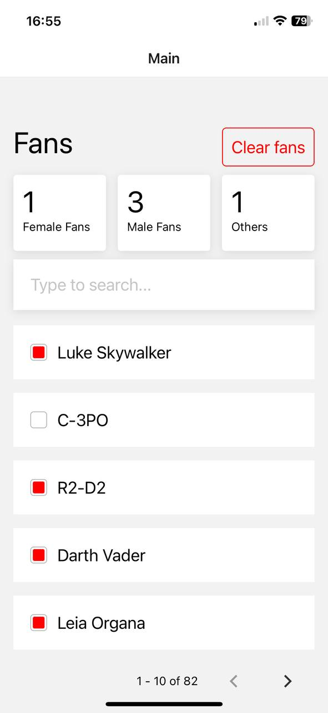

# StarWarsFavourites

<div>
  
</div>


# Star Wars Favorites Mobile Application

This mobile application, developed using React Native, allows users to indicate their favorite characters across the Star Wars Universe. Users can view a list of characters, access additional information about each character, and add characters to their favorites. The application also provides the total count of male, female, and other characters based on the user's selections. Additionally, users have the option to reset their favorites list and reset the total counts to zero.

## Features

- **API Request:** The application makes an API request to retrieve character information from the server.
- **Character List:** The retrieved character elements are displayed in a list format.
- **Character Details:** Clicking on any character in the list displays additional information on a dedicated screen.
- **Add to Favorites:** Users can add characters to their favorites list by clicking on the "Add to favorites" link/icon. The total vote count is recalculated accordingly.
- **Total Counts:** The application displays the total amounts of male, female, and other characters based on the user's selections.
- **Reset:** The "Reset" button allows users to flush all previously added favorite characters and reset the total count values to zero.

[](https://www.youtube.com/watch?v=IKirmHw-18o)

## Prerequisites

Before running the application, ensure that you have the following dependencies installed:

- Node.js
- React Native CLI
- Expo
- Android SDK (for Android development)
- Xcode (for iOS development)

## Getting Started

1. Clone this repository to your local machine.
2. Install the dependencies by running the following command in the project directory:

```shell
npm install
```

3. Start the Metro bundler by running the following command:
 ```shell
 expo start
 ```

 or

 ```shell
 npx react-native start
 ```


## Configuration

To configure the application, you need to update the API endpoint in the code. Locate the file responsible for API requests (e.g., api.js) and update the API_URL variable with the appropriate endpoint.

```shell
const API_URL = 'https://swapi.dev/api/people/';
```